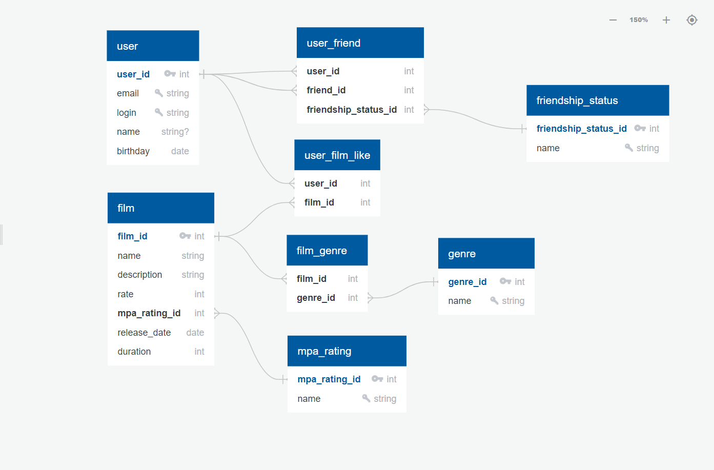

# java-filmorate
Template repository for Filmorate project.

# Документация по структуре базы данных

Ниже описывана схема базы данных, предназначенной для хранения информации о фильмах, пользователях, жанрах, рейтингах, а также связях, таких как отметки "нравится", дружба и жанры фильмов. А так же примеры запросов.

### Визуальная схема таблицы


## Описание таблиц

### `film`
Хранит информацию о фильмах.

- **film_id** `int` (Первичный ключ): Уникальный идентификатор фильма.
- **name** `string`: Название фильма.
- **description** `string`: Описание фильма.
- **rate** `int`: Оценка фильма пользователем.
- **mpa_rating_id** `int` (Внешний ключ >- `mpa_rating.mpa_rating_id`): Идентификатор рейтинга Ассоциации кинокомпаний (англ. _Motion Picture Association,_ сокращённо _МРА_)
- **release_date** `date`: Дата выхода фильма.
- **duration** `int`: Продолжительность фильма в минутах.

### `user`
Хранит информацию о пользователях.

- **user_id** `int` (Первичный ключ): Уникальный идентификатор пользователя.
- **email** `string` (Уникальное): Адрес электронной почты пользователя.
- **login** `string` (Уникальное): Логин пользователя.
- **name** `string` (NULL): Имя пользователя (опционально).
- **birthday** `date`: Дата рождения пользователя.

### `user_film_like`
Хранит информацию о фильмах, которые понравились пользователям.

- **user_id** `int` (Внешний ключ >- `user.user_id`): Идентификатор пользователя, которому нравится фильм.
- **film_id** `int` (Внешний ключ >- `film.film_id`): Идентификатор фильма, который понравился.

### `user_friend`
Хранит информацию о дружеских связях между пользователями.

- **user_id** `int` (Внешний ключ >- `user.user_id`): Идентификатор пользователя.
- **friend_id** `int` (Внешний ключ >- `user.user_id`): Идентификатор друга.
- **friendship_status_id** `int` (Внешний ключ >- `friendship_status.friendship_status_id`): Идентификатор статуса дружбы.

### `genre`
Хранит информацию о жанрах фильмов.

- **genre_id** `int` (Первичный ключ): Уникальный идентификатор жанра.
- **name** `string` (Уникальное): Название жанра.

### `film_genre`
Отображает связи между фильмами и их жанрами.

- **film_id** `int` (Внешний ключ >- `film.film_id`): Идентификатор фильма.
- **genre_id** `int` (Внешний ключ >- `genre.genre_id`): Идентификатор жанра.

### `mpa_rating`
Хранит информацию о рейтингах MPA (Motion Picture Association).

- **mpa_rating_id** `int` (Первичный ключ): Уникальный идентификатор рейтинга.
- **name** `string` (Уникальное): Название рейтинга.

### `friendship_status`
Хранит информацию о статусах дружбы.

- **friend_status_id** `int` (Первичный ключ): Уникальный идентификатор статуса дружбы.
- **name** `string` (Уникальное): Название статуса (например, "друзья", "заявка отправлена" и т.д.).

## Связи между таблицами

- `user_film_like`: устанавливает связь между пользователями и фильмами, которые им понравились.
- `user_friend`: устанавливает дружеские связи между пользователями, с указанием статуса дружбы.
- `film_genre`: устанавливает связь между фильмами и жанрами.

## Примеры запросов

*Замените `?` на соответствующие значения.*
#### 1. Выбор 10 популярных фильмов

```sql
SELECT * FROM film ORDER BY rate DESC LIMIT 10;
```
####  2. Добавление лайка фильму

```sql 
INSERT INTO user_film_like (user_id, film_id) VALUES (?, ?);
```
#### 3. Удаление лайка фильму

```sql 
DELETE FROM user_film_like WHERE user_id = ? AND film_id = ?;
```
#### 4. Добавление друга

```sql 
INSERT INTO user_friend (user_id, friend_id, friendship_status_id) VALUES (?, ?, ?);
```
#### 5. Удаление друга

```sql
DELETE FROM user_friend WHERE user_id = ? AND friend_id = ?; 
```
#### 6. Получение общих друзей

```sql
SELECT u2.user_id, u2.name
FROM user_friend uf1 
JOIN user_friend uf2 ON uf1.friend_id = uf2.friend_id 
JOIN users u2 ON uf2.friend_id = u2.user_id 
WHERE uf1.user_id = ? AND uf2.user_id = ?;
```